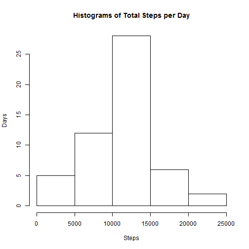
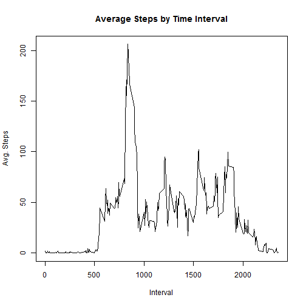
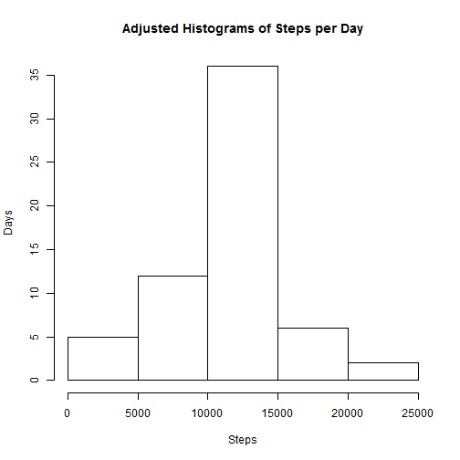
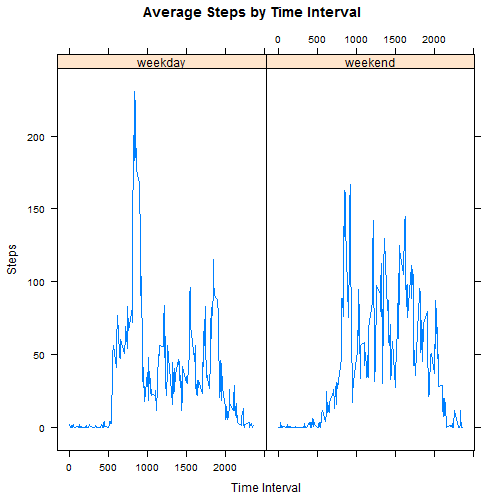

## Loading and preprocessing the data


```r
library(lubridate)
steps <- read.csv("./data/activity.csv")
steps$date <- ymd(steps$date)
good <- complete.cases(steps)
goodSteps <- steps[good,]
dailySteps <- aggregate(goodSteps$steps,by=list(goodSteps$date), FUN=sum)
names(dailySteps) <- c("date","steps")
```

## What is mean total number of steps taken per day?

```r
hist(dailySteps$steps,main="Histograms of Total Steps per Day",xlab = "Steps",ylab = "Days")
```

 

```r
origMean <- mean(dailySteps$steps)
origMedian <- median(dailySteps$steps)
paste("Mean steps per day:",round(origMean,digits = 4))
```

```
## [1] "Mean steps per day: 10766.1887"
```

```r
paste("Median steps per day:",origMedian)
```

```
## [1] "Median steps per day: 10765"
```


## What is the average daily activity pattern?

```r
activity <- aggregate(goodSteps$steps,by = list(goodSteps$interval), FUN = mean)
names(activity) <- c("interval","steps")
plot(activity$steps~activity$interval,type="l", 
     main="Average Steps by Time Interval", xlab="Interval",ylab="Avg. Steps")
```

 

```r
paste("Interval with Max Avg Steps Per Day:", activity[which.max(activity$steps),"interval"])
```

```
## [1] "Interval with Max Avg Steps Per Day: 835"
```

## Imputing missing values

```r
bad <- is.na(steps$steps)
paste("Missing Data in DataSet:",sum(bad),"Records")
```

```
## [1] "Missing Data in DataSet: 2304 Records"
```

```r
imputedSteps <- steps
imputedSteps$adjustedSteps <- imputedSteps$steps
for(j in 1:nrow(imputedSteps)) {
    if (is.na(imputedSteps[j,"steps"])) {
        interval <- imputedSteps[j,"interval"]
        adjustedSteps <- activity[activity$interval == interval,"steps"]
        imputedSteps[j,"adjustedSteps"] <- adjustedSteps
    } 
}

imputedDailySteps <- aggregate(imputedSteps$adjustedSteps,by=list(imputedSteps$date), FUN=sum)
names(imputedDailySteps) <- c("date","adjustedSteps")

hist(imputedDailySteps$adjustedSteps,main="Adjusted Histograms of Steps per Day",xlab = "Steps",ylab = "Days")
```

 

```r
newMean <- mean(imputedDailySteps$adjustedSteps)
newMedian <- median(imputedDailySteps$adjustedSteps)
meanDiff <- origMean - newMean
medianDiff <- origMedian - newMedian
paste("Adjusted Mean steps per day:",round(newMean,digits = 4))
```

```
## [1] "Adjusted Mean steps per day: 10766.1887"
```

```r
paste("Adjusted Median steps per day:",round(newMedian,digits = 4))
```

```
## [1] "Adjusted Median steps per day: 10766.1887"
```

```r
paste("Difference in Means:",round(meanDiff,digits = 4))
```

```
## [1] "Difference in Means: 0"
```

```r
paste("Difference in Medians:",round(medianDiff,digits = 4))
```

```
## [1] "Difference in Medians: -1.1887"
```
There is no significant difference in **means** (difference = 0) or **median** (difference = -1.1887).
However, there is an impact on the standard deviation of the total steps per day:

```r
origSD <- sd(dailySteps$steps)
newSD <- sd(imputedDailySteps$adjustedSteps)
paste("SD of Daily Total of Original Steps:",round(origSD,digits = 4))
```

```
## [1] "SD of Daily Total of Original Steps: 4269.1805"
```

```r
paste("SD of Daily Total of Adjusted Steps:",round(newSD,digits = 4))
```

```
## [1] "SD of Daily Total of Adjusted Steps: 3974.3907"
```


## Are there differences in activity patterns between weekdays and weekends?

```r
library(lattice)
imputedSteps$daytype <- factor(ifelse(weekdays(imputedSteps$date,abbreviate = TRUE) %in% 
                                          c("Sat","Sun"),"weekend","weekday"))
activityDaytype <- aggregate(imputedSteps$adjustedSteps,
                             by = list(imputedSteps$interval,imputedSteps$daytype), FUN = mean)
names(activityDaytype) <- c("interval","daytype","steps")

xyplot(activityDaytype$steps~activityDaytype$interval|activityDaytype$daytype,
       type="l",xlab="Time Interval",ylab="Steps",main="Average Steps by Time Interval")
```

 

